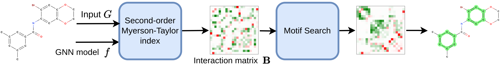

# Official implementation of "Explaining Graph Neural Networks via Structure-aware Interaction Index" (ICML'24)

<a href="https://arxiv.org/abs/2405.14352"></a>
<div align="center">
  <a href="https://ngocbh.github.io/" target="_blank">Ngoc&nbsp;Bui</a> &emsp;
  <a href="https://hieunt91.github.io/" target="_blank">Hieu&nbsp;Trung&nbsp;Nguyen</a> &emsp;
  <a href="https://www.vietanhnguyen.net/" target="_blank">Viet&nbsp;Anh&nbsp;Nguyen</a> &emsp;
  <a href="https://www.cs.yale.edu/homes/ying-rex/" target="_blank">Rex&nbsp;Ying</a> &emsp;
  <br> <br>
</div>
<br>

<div align="center">
    
</div>


Details of algorithms and experimental results can be found in [our paper](https://arxiv.org/abs/2405.14352):
```bibtex
@article{bui2024explaining,
  title={Explaining Graph Neural Networks via Structure-aware Interaction Index},
  author={Bui, Ngoc and Nguyen, Hieu Trung and Nguyen, Viet Anh and Ying, Rex},
  booktitle={International Conference on Machine Learning},
  organization={PMLR},
  year={2024}
}
```
Please consider citing this paper if it is helpful for you.

## Installation

Requirements:

```sh
python 3.8.17
conda install pytorch==1.11.0 torchvision==0.12.0 torchaudio==0.11.0 cudatoolkit=11.3 -c pytorch
pip install torch-scatter==2.0.9 torch-sparse==0.6.13 torch-cluster==1.6.0 torch-spline-conv==1.2.1 -f https://data.pyg.org/whl/torch-1.11.0+cu113.html
CUDA version 11.3
# torch-scatter torch-sparse -f https://data.pyg.org/whl/torch-1.11.1+${CUDA}.html
```

```sh
pip install -r requirements.txt
```

Mosek Requirement: request a trial for [mosek license](https://www.mosek.com/license/request/). Put the license in `~/mosek/mosek.lic`

## Train GNNs
To train a gnn model on a new dataset
```
python train_gnns.py models=<model_name> datasets=<dataset_name>
```

We also provide checkpoints for models we used in `checkpoints` directory of this repo. We highly recommend using these checkpoints to reproduce the results of our paper. Some of the checkpoints are downloaded directly from [SubgraphX repo](https://github.com/divelab/DIG/tree/dig-stable/benchmarks/xgraph)

## Availability

#### Datasets

- For single motif experiment: 
    - `ba_2motifs`
    - `ba_house_grid`
    - `spmotif`
    - `mnist75sp`
- For multiple motifs experiment: 
    - `ba_house_and_grid`
    - `ba_house_or_grid`
    - `mutag0`
    - `benzene`

- for text experiment:
    - `graph_sst5`
    - `twitter`

Text Experiment note:
- Download text dataset from [haiyang's google drive](https://drive.google.com/drive/folders/1dt0aGMBvCEUYzaG00TYu1D03GPO7305z).
- Unzip datasets into /datasets folder
- Change name of folder and files inside the raw folder. `Graph-SST2` -> `graph_sst2` ; `Graph-Twitter` -> `twitter` 
- Run with experiments=single_motif

#### Methods

We compare our method (MAGE `mage`) with the following baselines: `same`, `gstarx`, `subgraphx`, `match_explainer`, `pgexplainer`, `gnn_explainer`, `grad_cam`.

We tested with three following models: `gcn`, `gin`, and `gat` (the current implementation of GAT does not support `grad_cam`, `pgexplainer`, `gnn_explainer`).

## Usage
To reproduce the results on single motif datasets (`ba_2motifs`, `ba_house_grid`, `spmotif`, `mnist75sp`)
```sh
python run.py explainers=<explainer_names> models=<model_name> datasets=<dataset_name> experiments=single_motif
```


To reproduce the results on multi motif datasets (`ba_house_and_grid`, `ba_house_or_grid`, `mutag0`, `benzene`)
```sh
python run.py explainers=<explainer_names> models=<model_name> datasets=<dataset_name> experiments=multi_motifs
```

To reproduce the results on sentiment classification datasets (`graphsst2`, `twitter`)
```sh
python run.py explainers=<explainer_names> models=<model_name> datasets=<dataset_name> experiments=single_motif
```

other params that could be included:
```sh
    experiments=<experiment_name> # single_motif, multi_motifs
    device_id=0 # GPU id
    rerun=True # Rerun the experiment or not
    max_ins=<number> # maximum number of evaluated instances
```

Example:
```sh
python3 run.py explainers=mage models=gcn datasets=ba_2motifs experiments=single_motif rerun=True run_id=5 random_seed=1
```

### Evaluation Metrics
After running the experiments, results are saved in the json file `/results/[runid]/[dataset]/[model]/[experiment]/results.json`. 

The performance metrics reported in the paper correspond to the following keys in results.json:
- F1: `node_f1_score`
- AUC: `auc`
- AMI: `ami_score`
- Fid_alpha: `fid_delta`
- Fid: `org_fid_delta`

## Acknowledgement

A substantial portion of the source code has been borrowed from the following repositories:

- https://github.com/divelab/DIG/tree/dig-stable/benchmarks/xgraph
- https://github.com/ShichangZh/GStarX
- https://github.com/SAME2023NeurIPS/SAME
- https://github.com/k-amara/GInX-Eval
- https://github.com/smiles724/MatchExplainer
- https://github.com/Wuyxin/ReFine
- https://github.com/AndMastro/EdgeSHAPer

## Contact

If you have any problems, please open an issue in this repository or send an email to [ngoc.bui@yale.edu](mailto:ngoc.bui@yale.edu).
